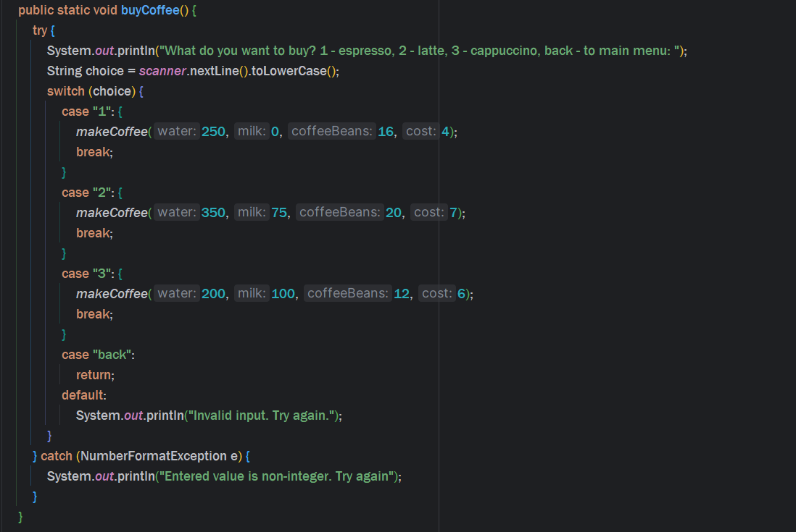
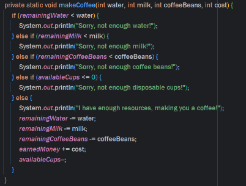
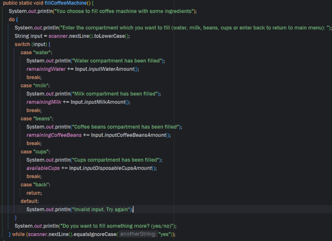

# Virtual Coffee Machine
### Introduce information
This project shows how to solve "Coffee Machine", which you can get
[here(just click)](https://hyperskill.org/study-plan)!  
#### Attention!
This project is ideal for beginners because it shows how to solve this problem, but there is a nuance! 
Some pieces of code are fixed, rewritten and added to improve the idea of the task and improve the UX  
Below will be described all methods and added comments, which methods are needed
to solve task without problems in tests!
### Сode explanation
#### Class [CoffeeMachine](src/machine/CoffeeMachine.java)
This is our main class, in which our menu will be run!  
This class contain only one method, which called "run", explanation to which I will describe below
#### Class [Input](src/machine/Input.java)
This class contains 4 methods, which are responsible for inputting the value for the work  
All methods were invented by me to improve the code, if you need to complete a task to create a project, you need to set values
for the fields that are specified by the condition in the task of this project  
All the logic of these methods is thought out and all errors are thought out, especially NumberFormatException
(there should be no more mistakes :))
#### Class [CoffeeMachineWork](src/machine/CoffeeMachineWork.java)
Our main file, where all the logic of this project is written  
Let's deal with the fields first, all the fields with which we will work are added in this file, the logic of the code also works according to the encapsulation method
  
All these fields take the value 0, this is done solely to improve the code and introduce the input methods I described above
#### Method run()
  
The method without which the writing of this project is not possible, there is no logic added by me,
all you must know, that this method use switch to work with written option,   
if option are correct - calls the methods corresponding to the option name (all methods will be described below)  
if option is invalid, asks to enter option again
##### Method buyCoffee()

This method is fundamental to the operation of your code, in which we pass the 
main logic behind the creation of coffee drinks.  
Works through a switch, where we enter what type of coffee drink we need(each drink has its own number of ingredients to create), if we 
enter a value for which we have no logic - we return to the main menu or we can enter back to return to the main menu
##### Method makeCoffee()
  
The essence is quite simple:
1) Reads what drink we want from the method buyCoffee()
2) Enter the required number of ingredients through arguments
3) If the amount is sufficient - subtract the ingredients we need from the total amount of available ingredients
4) If the amount is not enough - go to the main menu  
#### Method fillCoffeeMachine()

The method without which the writing of this project is not possible, but there is a nuance, the logic is supplemented by me and processed for a better UX  
The logic is as follows:
1) We read which compartment of our coffee machine we want to fill
2) If the name of the compartment is entered correctly - fill in our coffee machine using input methods
3) If the entered name of the compartment is incorrect - we ask the user to enter the name again
4) After successful or unsuccessful refilling of the coffee machine, we ask if the user wants to enter another compartment name for filling, if not - we go to the main menu, if so - we perform the same operation again, thanking do-while  
#### Method clearCoffeeMachine()
Logic the same as in the method above, but this method is created by me, so there is no need to add this method for solve the tasks successfully
#### Method takeMoney()
  
The method without which the writing of this project is not possible, there is no logic added by me, and logic is so easy,
so there is no need to explain what this method does
#### Method statsOfCoffeeMachine()
  
The method without which the writing of this project is not possible, there is no logic added by me, and logic is so easy,
so there is no need to explain what this method does, all you must know, that this method output all stats of our coffee machine
#### Method exit()
  
The method without which the writing of this project is not possible, there is no logic added by me,
all you must know, that this method use System.exit() to stop the program

### Thank you for your attention!
I hope you enjoyed reading the logic of my project and this README file, for feedback
write me at [telegram](https://t.me/sunshineqqw)!  
### Good luck and have a nice day!