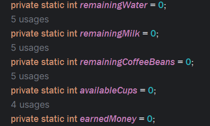
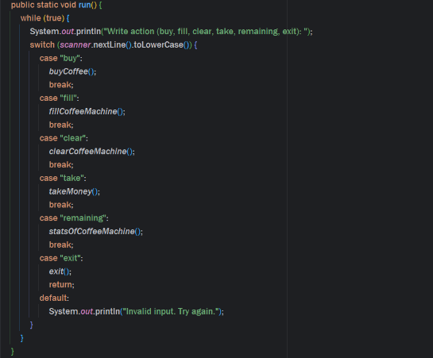
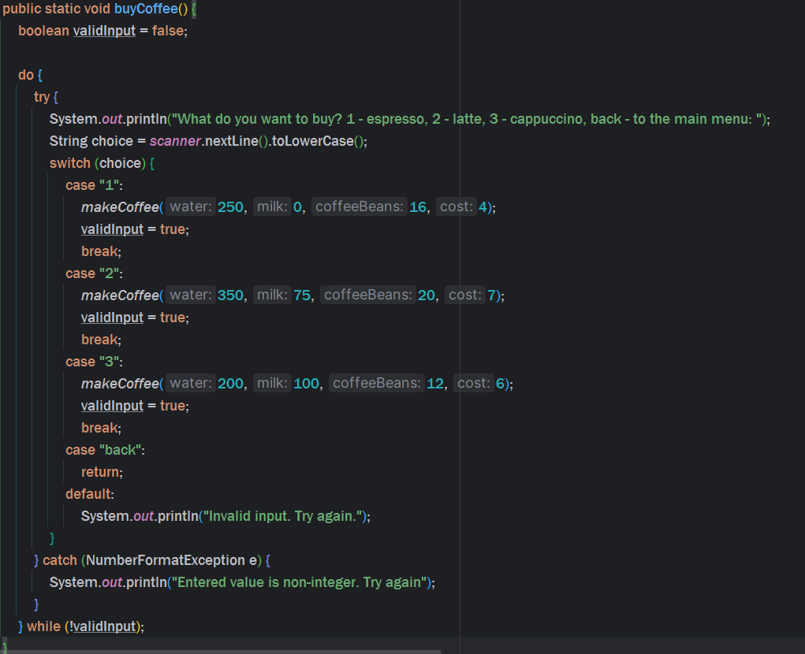
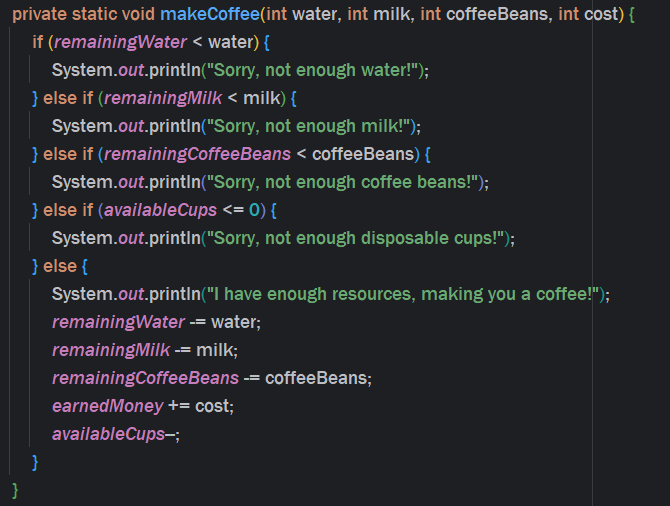
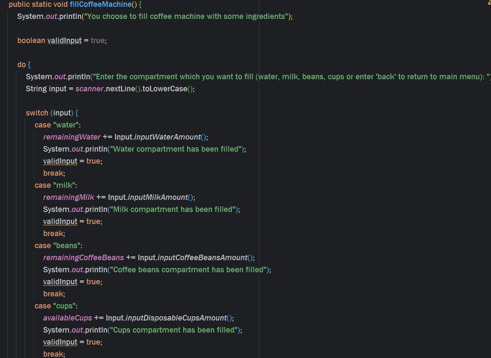
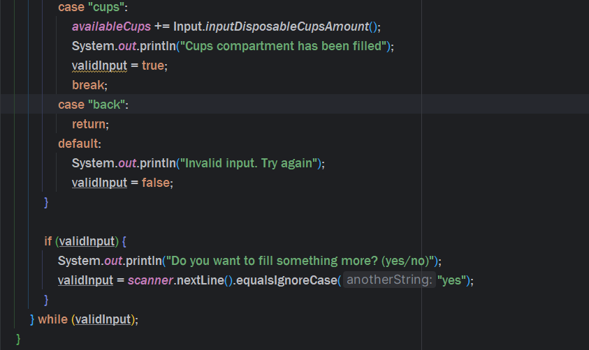
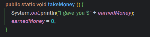
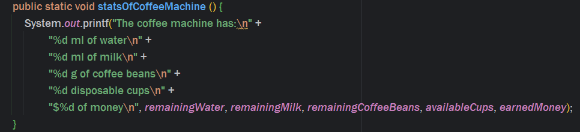
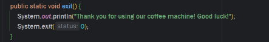

# Coffee Machine from Hyperskill

This project is created to help those beginners who chose the "Coffee machine" project for themselves and want to understand the logic of the code for the project  
Idea and tasks for this project I took [here ](https://hyperskill.org/study-plan)

### Attention!

The logic of the code is slightly added and improved by me, in order to improve the work of the project and the UX
For each described method or class, I will write whether this method is important for the successful completion of the project or not

## Code explanation

### Class [CoffeeMachine](src/machine/CoffeeMachine.java)

This is the class that contains our main method, it calls only one function that plays the role of the menu of our program (the principle of operation will be described below)

### Class [Input](src/machine/Input.java)

A class that contains 4 methods that are responsible for entering values into the fields of our ingredients. The idea of this methods is added by me and designed so as not to litter the class which contains the logic of the program.

### Class [CoffeeMachineWork](src/machine/CoffeeMachineWork.java)

I think it is worth first dealing with our fields:
Each field on the screen below (except earnedMoney) is equivalent to an ingredient that a coffee machine needs to create a coffee drink
In my code, the values of these fields are equivalent to zero and input is possible through the methods of the Input class, in the project tasks you will be given the numbers that you need to work with

#### Method run()

This method is the main menu of our program, which works according to the well-known switch principle:  
We enter through the scanner an option from those options that are given to us when starting the program, if the entered option is correct - a method equivalent to this option by name is executed, if not - the method asks to enter the option again

#### Method buyCoffee()

The method without which the existence of program logic and the successful writing of the project are impossible, the method is not supplemented and is easy to implement.
The whole point is also in the switch that works with the scanner, where we ask to enter the number of the drink we want or back to return to the main menu. If the selected option is incorrect, it asks to enter the drink number one more time

#### Method makeCoffee()

The method without which the existence of program logic and the successful writing of the project are impossible, the method is not supplemented and is easy to implement.
The implementation consists in checking the required number of ingredients to create coffee (for each coffee, according to the conditions of the task, there is a different number of ingredients), if the number of available ingredients is greater than the required number - we output a message about the successful production of coffee and subtract the required amount from the available amount, if not - we deduce exactly which ingredients we lack

#### Method fillCoffeeMachine()

The method without which the existence of program logic and the successful writing of the project are impossible, the method is improved by me, it could be written more easily, but this code is better for user use than the code that the task suggests  
The essence is the same use of switch and do-while loop, which check the validity of the input through a boolean, if the validity is correct - adding to the selected field the number of elements we want to add through the methods of the Input class, if not - we ask to enter the compartment name again

#### Method clearCoffeeMachine()

This method is completely invented and added by me, the logic is the same as in the method above, when creating a project, you can either pay attention to this method or not, the tests will not react to it

#### Method takeMoney()

The method, the creation of which is essential to the execution of the project, also the method is very simple and does not need elaboration or explanation

##### Method statsOfCoffeeMachine()

The method, the creation of which is essential to the execution of the project, also the method is very simple and does not need elaboration or explanation

#### Method exit()

The method, the creation of which is essential to the execution of the project, also the method is very simple and does not need elaboration or explanation
